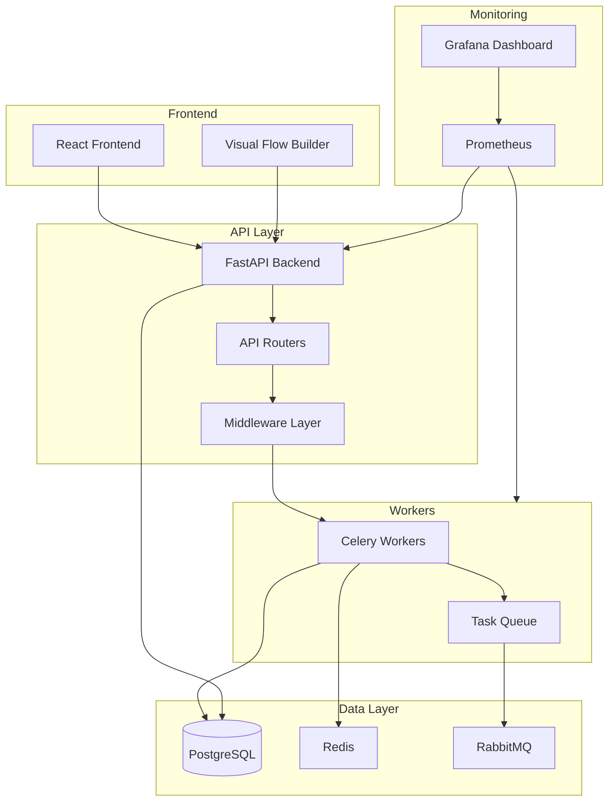
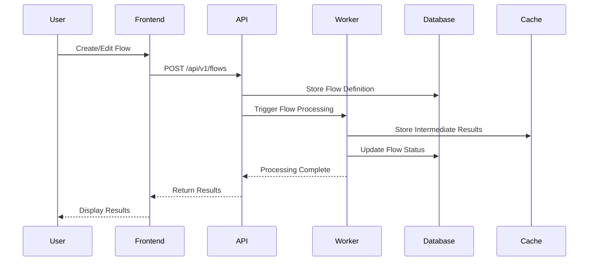
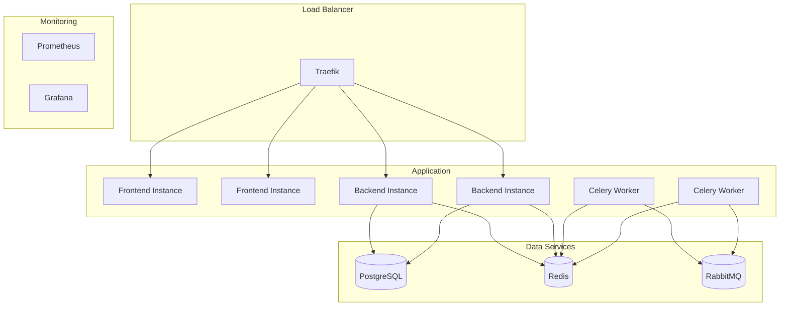
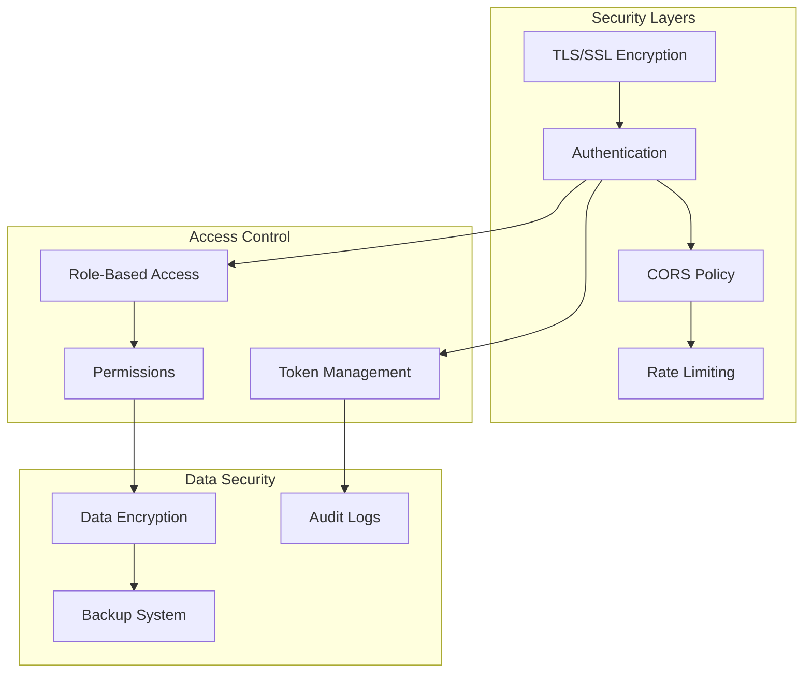

# Langflow Architecture Documentation

## Overview

Langflow is a powerful tool for building and deploying AI-powered agents and workflows. It provides both a visual authoring experience and a built-in API server that turns every agent into an API endpoint.

## System Architecture

## Component Details

### 1. Frontend Layer
- **React Frontend**: Visual interface for flow creation
- **Flow Builder**: Drag-and-drop interface for creating workflows
- Communicates with backend via REST API

### 2. API Layer
- **FastAPI Backend**: Main application server
- **API Routers**: Handle different API endpoints
- **Middleware**: 
  - Request/Response processing
  - Authentication
  - CORS
  - Content size limiting
  - Error handling

### 3. Worker Layer
- **Celery Workers**: Process async tasks
- **Task Queue**: Manages task distribution
- Uses RabbitMQ as message broker
- Redis for result backend

### 4. Data Layer
- **PostgreSQL**: Main database
- **Redis**: Caching and task results
- **RabbitMQ**: Message queue system

### 5. Monitoring
- **Prometheus**: Metrics collection
- **Grafana**: Visualization and monitoring

## Data Flow

## Deployment Architecture

## Security Architecture

## Key Features
1. **Visual Builder**: Drag-and-drop interface for workflow creation
2. **Code Access**: Python-based component customization
3. **Playground**: Interactive testing environment
4. **Multi-agent Support**: Orchestration and conversation management
5. **API Deployment**: Automatic API endpoint generation
6. **Observability**: Integration with monitoring tools
7. **Enterprise Features**: Security and scalability focus

## Configuration and Setup
- Environment variables control various aspects of the system
- Supports Docker-based deployment
- Scalable architecture for enterprise use
- Monitoring and logging integration

## Integration Points
1. **External APIs**: Support for various LLM providers
2. **Vector Databases**: Integration capabilities
3. **Monitoring Tools**: Prometheus/Grafana integration
4. **Custom Components**: Extensible architecture

## Development Guidelines
1. Follow FastAPI best practices for backend development
2. Use async/await patterns for better performance
3. Implement proper error handling and logging
4. Maintain test coverage for critical components
5. Document API changes and new features