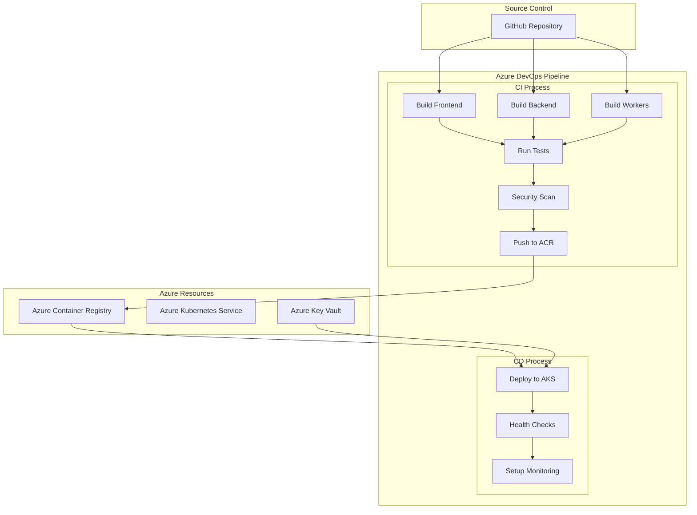
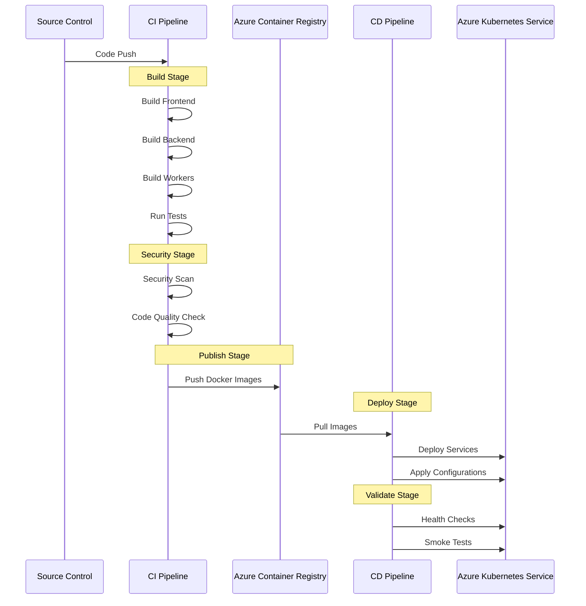

# Azure CI/CD Pipeline Plan for Langflow

## Overview

This document outlines the implementation plan for setting up a CI/CD pipeline in Azure for the Langflow application, which consists of frontend, backend, workers, and data services components.

## Pipeline Architecture



## Implementation Steps

### 1. Azure Resource Setup
- Create Azure Container Registry (ACR)
  - Configure registry access policies
  - Set up image retention policies
  - Enable vulnerability scanning
  
- Set up Azure Kubernetes Service (AKS)
  - Configure node pools
  - Set up networking
  - Enable monitoring
  
- Configure Azure Key Vault
  - Store application secrets
  - Configure access policies
  - Set up service principal access

### 2. Azure DevOps Configuration
- Create new Azure DevOps project
- Set up service connections
  - GitHub connection
  - Azure subscription connection
  - Container registry connection
- Configure production environment
- Set up variable groups for configuration management

### 3. Pipeline Configuration Files

```yaml
# Sample pipeline structure
trigger:
  - main

variables:
  - group: langflow-production

stages:
  - stage: Build
    jobs:
      - job: BuildComponents
        steps:
          - template: templates/build-frontend.yml
          - template: templates/build-backend.yml
          - template: templates/build-workers.yml

  - stage: Test
    jobs:
      - job: RunTests
        steps:
          - template: templates/run-tests.yml

  - stage: Deploy
    jobs:
      - deployment: Production
        environment: production
        strategy:
          rolling:
            maxParallel: 2
```

## Pipeline Flow



## Detailed Specifications

### Build Configuration
- Multi-stage Dockerfiles for optimization
- Layer caching for faster builds
- Parallel component builds
- Artifact management

### Testing Strategy
- Unit tests execution
- Integration tests
- Security scanning
  - Container image scanning
  - Dependency scanning
  - Code analysis

### Deployment Strategy
- Rolling updates for zero-downtime deployment
- Automatic rollback on failure
- Health check implementation
- Configuration management
- Secret handling

### Monitoring Setup
- Azure Monitor integration
- Application Insights configuration
- Container insights
- Custom metrics for Prometheus/Grafana
- Alert configuration

## Security Considerations
- RBAC configuration
- Network security policies
- Secret management
- Image scanning
- Access control

## Next Steps
1. Set up Azure resources according to the plan
2. Configure Azure DevOps project
3. Implement pipeline configuration files
4. Set up monitoring and alerting
5. Test the complete pipeline