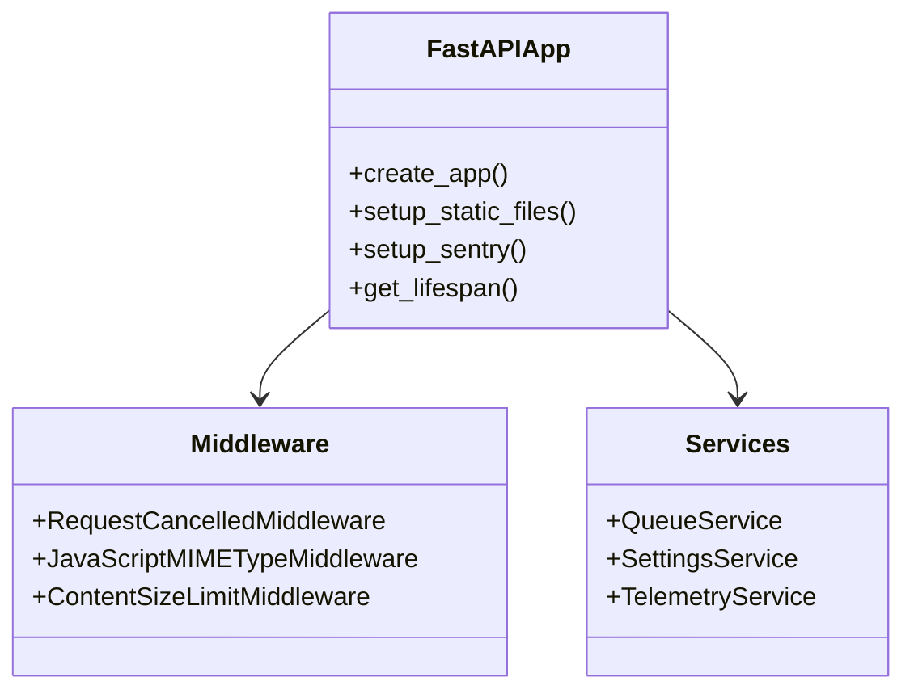
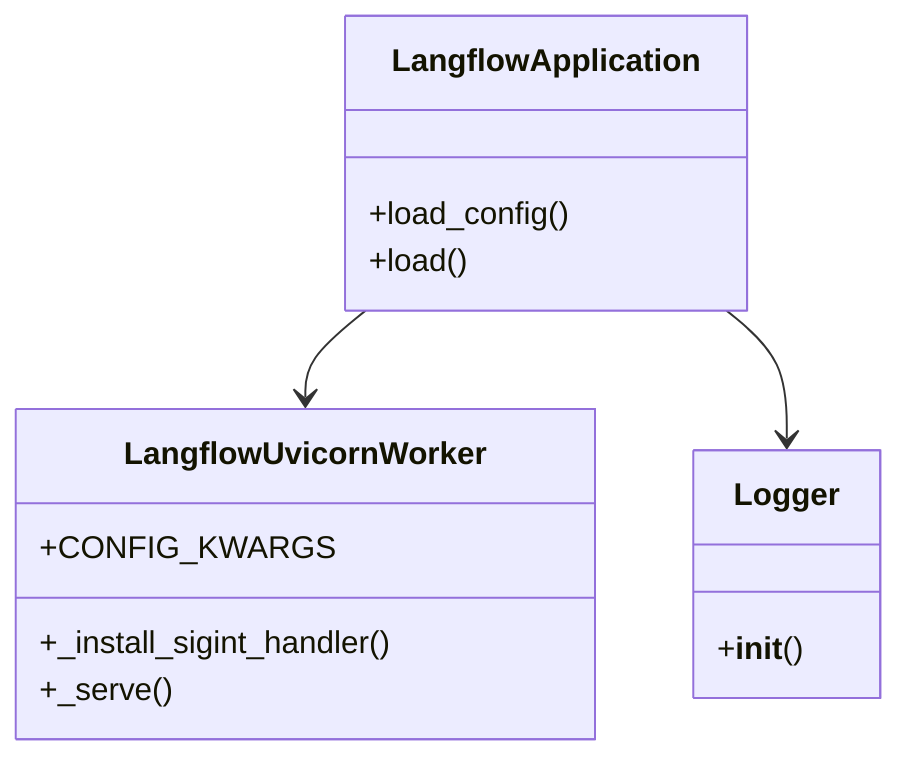
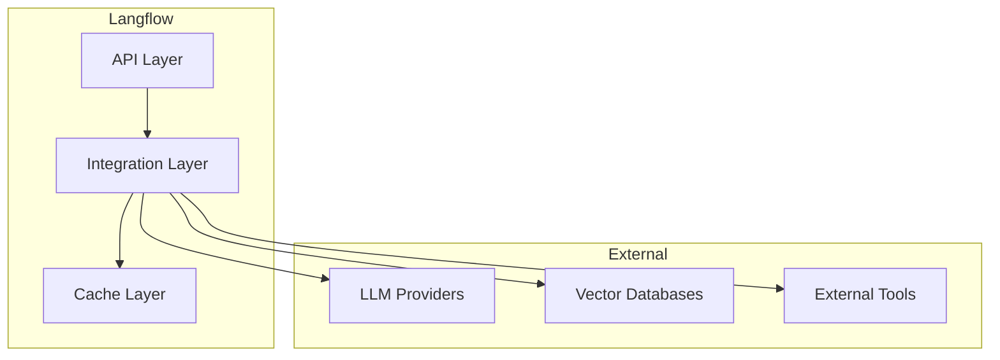
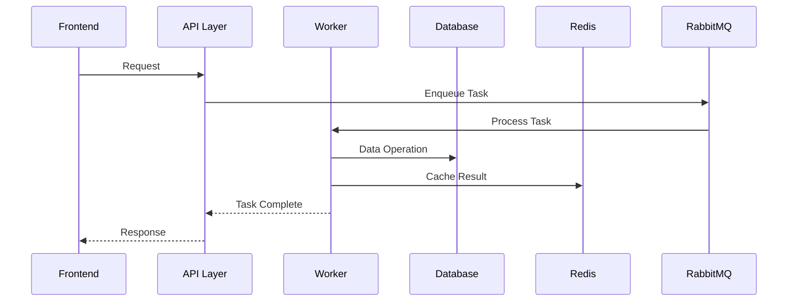

# Langflow Component Technical Documentation

## Backend Components

### 1. FastAPI Application (main.py)
- **Purpose**: Core application server that handles HTTP requests and manages the application lifecycle
- **Key Features**:
  - Custom middleware for request cancellation and MIME type handling
  - CORS support
  - Static file serving
  - Prometheus metrics integration
  - Error handling middleware



### 2. Server Component (server.py)
- **Purpose**: Handles server configuration and worker management
- **Features**:
  - Custom Uvicorn worker implementation
  - Gunicorn integration
  - Custom logging setup
  - Signal handling



### 3. Worker System (worker.py)
- **Purpose**: Handles asynchronous task processing
- **Components**:
  - Celery worker configuration
  - Task queue management
  - Result backend integration
- **Features**:
  - Asynchronous task processing
  - Task status tracking
  - Error handling and retries

### 4. Memory Management (memory.py)
- **Purpose**: Manages application state and caching
- **Features**:
  - Memory allocation and cleanup
  - Cache invalidation
  - State persistence

### 5. Settings Management (settings.py)
- **Purpose**: Application configuration management
- **Features**:
  - Environment variable handling
  - Configuration validation
  - Default settings management

## Data Storage Components

### 1. PostgreSQL Database
- **Purpose**: Primary data storage
- **Schema**:
  - User data
  - Flow definitions
  - System configuration
- **Features**:
  - ACID compliance
  - Transaction support
  - Data versioning

### 2. Redis Cache
- **Purpose**: Temporary data storage and caching
- **Usage**:
  - Session management
  - Rate limiting
  - Task result storage
- **Features**:
  - In-memory storage
  - Key expiration
  - Pub/sub capabilities

### 3. RabbitMQ Message Queue
- **Purpose**: Message broker for task distribution
- **Features**:
  - Message persistence
  - Queue management
  - Routing capabilities
  - Dead letter handling

## Frontend Components

### 1. React Frontend
- **Purpose**: User interface and interaction
- **Features**:
  - Flow builder interface
  - Component library
  - State management
  - API integration

### 2. Nginx Configuration
```nginx
# Key configuration elements
location /api/ {
    proxy_pass http://backend:7860;
    proxy_set_header Host $host;
    proxy_set_header X-Real-IP $remote_addr;
}

location / {
    root /usr/share/nginx/html;
    try_files $uri $uri/ /index.html;
}
```

## Monitoring Components

### 1. Prometheus
- **Purpose**: Metrics collection and storage
- **Metrics**:
  - Request latency
  - Error rates
  - System resources
  - Custom business metrics

### 2. Grafana
- **Purpose**: Visualization and alerting
- **Features**:
  - Custom dashboards
  - Alert configuration
  - Data visualization

## Integration Points

### 1. External API Integration


### 2. Component Communication


## Security Implementations

### 1. Authentication System
- JWT token management
- Session handling
- Role-based access control

### 2. Data Protection
- Input validation
- SQL injection prevention
- XSS protection
- CSRF protection

### 3. Rate Limiting
- Request rate limiting
- Concurrent connection limits
- API usage quotas

## Error Handling

### 1. Global Error Handling
- Custom error types
- Error logging
- Client error responses

### 2. Task Error Handling
- Retry mechanisms
- Dead letter queues
- Error notification system

## Testing Infrastructure

### 1. Unit Tests
- Component testing
- Service testing
- Model testing

### 2. Integration Tests
- API testing
- Worker testing
- Database testing

### 3. Performance Tests
- Load testing
- Stress testing
- Endurance testing